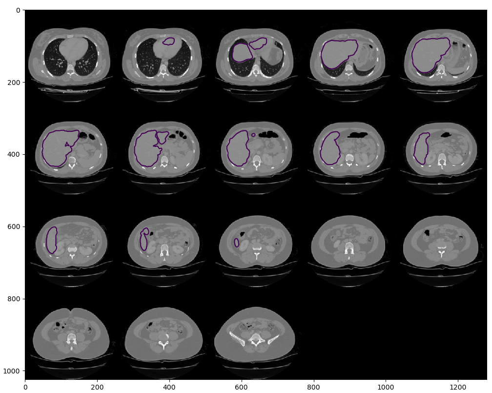
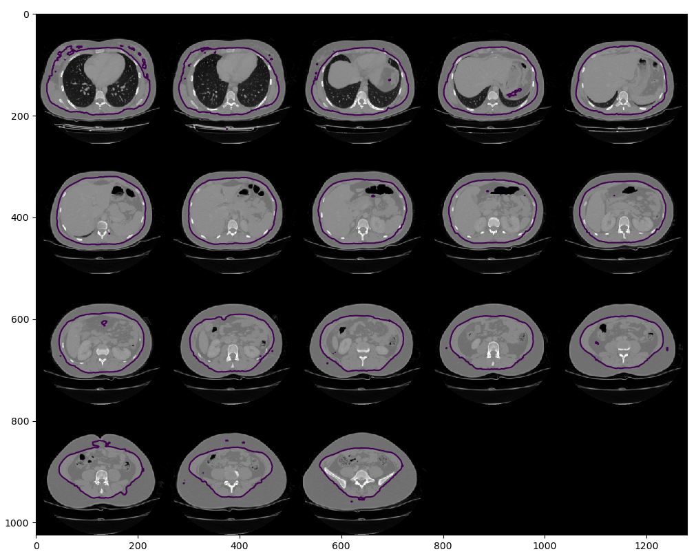
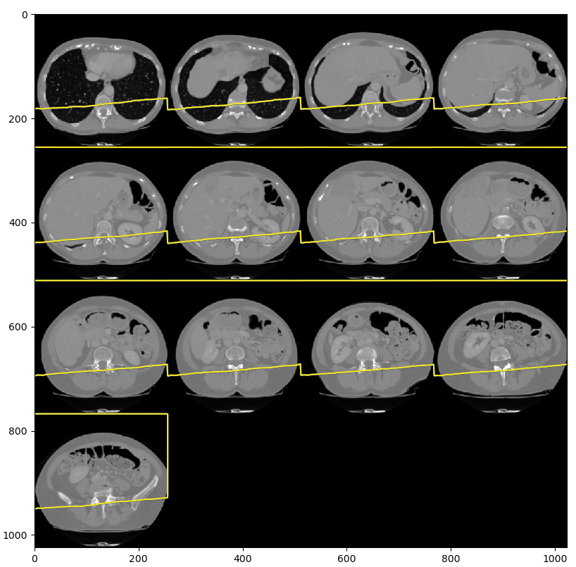

# bodyposition

Estimation of a voxel's position inside body, it's relative distances to organs and/or anatomical structures.

Liver segmentation

Fatless body signed distance field

Coronal (frontal) plane


# about

This is a repository for a bachelor's thesis work, developed by [Václav Javorek](https://github.com/vjavorek) under the supervision of [Miroslav Jiřík](https://github.com/mjirik).

Methods of computer vision are being used in medicine and radiology for quite some time. Computed tomography image data segmentation programs have been developed to automate data processing and make the work of radiologists and doctors easier. This thesis builds on previous research and applies a modern convolutional neural network approach. Using a high-quality normalized dataset, models were trained that attempt to match or improve the results of classical computer vision methods such as abdominal organ segmentation. The models developed have a specific U-Net architecture - a fully convolutional neural network. Their output is a signed distance field indicating for each point of the CT slice its distance to the segmented structure. The robust segmentation methods of the bodynavigation library were used as the basis for training (ground truth). Last but not least, the aim of this work is to speed up the segmentation significantly.

# installation

    conda install -c mjirik -c conda-forge bodyposition

# example


```python
import numpy as np
import io3d
import sed3

import bodyposition as bpo

data3d_orig = io3d.read_dataset("3Dircadb1", "data3d", 1)
bp = bpo.BodyPosition(data3d_orig['data3d'], data3d_orig['voxelsize_mm'])
sdf_surface = bp.dist_to_surface()

sed3.show_slices(np.asarray(data3d_orig['data3d'][0:-1]), np.asarray(sdf_surface[0:-1]), slice_step=10, axis=0)
```

# API functions
    
    bpo.dist_to_sagittal()
    bpo.dist_to_coronal()
    bpo.dist_to_surface()
    bpo.dist_to_fatless()
    bpo.dist_to_bones()
    bpo.dist_to_liver()
    bpo.dist_to_lungs()
    bpo.dist_to_spleen()
    
    bpo.get_data(dataset, scannum)
    bpo.download_model(sdf_type)
